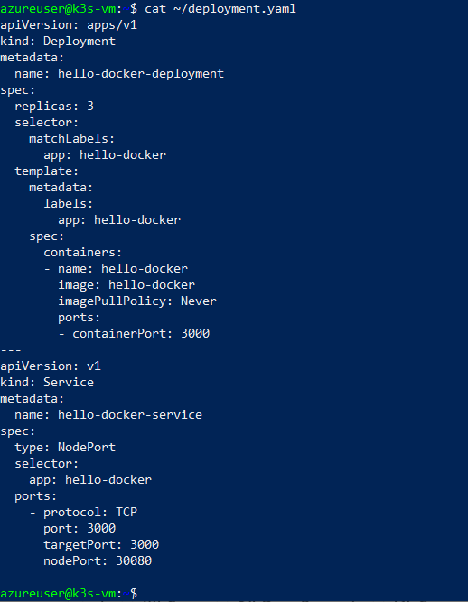
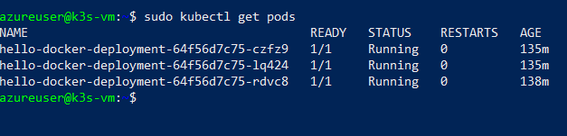

# Screenshots significativi del progetto

Questa sezione raccoglie gli screenshot delle fasi chiave del progetto di deploy con Docker, K3s e Terraform su VM Azure.

---

## 1. Struttura progetto Terraform

---

## 2. Cartella con chiavi SSH generate

---

## 3. Connessione SSH alla VM

---

## 4. Stato di K3s

---

## 5. Immagini Docker visibili

---

## 6. Contenuto del file `deployment.yaml`

---

## 7. Verifica dei pod con `kubectl`

---

## 8. Verifica dei servizi esposti

---

## 9. Output finale nel browser

